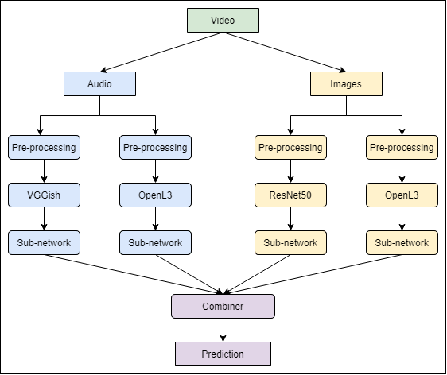

## About
This project contains an ensemble scene classifier utilizing late fusion and
base classifiers with
different pre-trained models as feature extractors. There are 2 classifiers
for both audio and visual modality.

In the project, `scene` is defined as a name of a scene, and `label` as a 
number corresponding to a scene in alphabetical order.

The program is designed for the
TAU Urban Audio-Visual Scenes 2021 dataset,
but should be integrable for
other audio and/or visual datasets that supply the data as .wav or .mp4 files.
However, editing the program is necessary, depending on the dataset's structure and
the duration of the file contents. The program has been tested on Windows 10,
and is not guaranteed to work on
other operating systems.

## Results
F1 scores of the base classifiers and the ensemble model on the test set
can be seen in the table below. The particular ensemble model uses a mean
combiner without weights.

| scene           | audio VGGish | audio OpenL3 | visual ResNet | visual OpenL3 | ensemble |
|:----------------|--------------|--------------|---------------|---------------|----------|
airport           | 0.374        | 0.702        |   0.694       | 0.345         | **0.819** |
bus               | 0.557        | 0.741        |   0.755       | 0.715         | **0.853** |
metro             | 0.519        | 0.565        |   0.881       | 0.743         | **0.960** |
metro_station     | 0.566        | 0.626        | **0.951**     | 0.783         |   0.928   |
park              | 0.888        | 0.869        |   0.894       | 0.848         | **0.943** |
public_square     | 0.533        | 0.570        |   0.744       | 0.522         | **0.788** |
shopping_mall     | 0.599        | 0.673        |   0.846       | 0.582         | **0.905** |
street_pedestrian | 0.561        | 0.618        |   0.823       | 0.670         | **0.859** |
street_traffic    | 0.838        | 0.821        |   0.809       | 0.740         | **0.936** |
tram              | 0.510        | 0.659        |   0.567       | 0.417         | **0.751** |
|||||||
macro average     | 0.594        | 0.684        |   0.797       | 0.637         | **0.874** |

The base model parameters and the used training-validation split CSVs used to get these
results are supplied in the repository. However, the base models can still be
improved with a more extensive tuning of the architectures and hyperparameters.

## Installation
The project uses two environments due to the different implementations
of the pre-trained models. The main environment is used most of the time,
but the secondary one is used when extracting features with the OpenL3 library.

Both environments utilize a GPU in their machine learning frameworks, but the
project should work on a CPU (installing a CPU variant of a TensorFlow package
may be necessary). Using a GPU is heavily recommended.

For the main environment, [download](https://www.python.org/downloads/) and
install Python 3.8 (or later). Create a new 
virtual environment, and after activating it, ensure that pip is up-to-date
`easy_install -U pip` (version >= 21 required). The packages can be installed
by running `pip install -r requirements_main.txt`. The installation of these
packages can take several minutes.

To utilize a GPU, the installed PyTorch 1.7.1 and
TensorFlow 2.4.1 both use Cuda version 11.0, which needs to be installed
manually from https://developer.nvidia.com/cuda-11.0-download-archive. Note
that Cuda v11.0 requires a GPU with a
minimum [compute capability](https://developer.nvidia.com/cuda-gpus) of 3.5.
TensorFlow 2.4.1 also requires the installation of cuDNN 8.1.0
from https://developer.nvidia.com/rdp/cudnn-archive (instructions
[here](https://docs.nvidia.com/deeplearning/cudnn/archives/cudnn-810/install-guide/index.html)).

For installing the secondary venv, the initial packages are installed with conda
`conda create --name <env> python=3.6 --file requirements_secondary_conda.txt`.
Conda automatically installs the required Cuda files for running the TensorFlow
1.12 on a GPU. After activating the environment, the rest of the packages are
installed with `pip install -r requirements_secondary_pip.txt`.

VGGish pre-trained model requires the installation of 
[VGGish model checkpoint](https://storage.googleapis.com/audioset/vggish_model.ckpt).
Additionally, [Embedding PCA parameters](https://storage.googleapis.com/audioset/vggish_pca_params.npz),
can also be installed for PCA transformation of the VGGish embeddings, but
the transformation is not done in this project by default and is not needed to
run the program. The installed files are placed in the
VGGish folder.

The other pre-trained models do not require manual installations.
OpenL3 is a Python library whose dependencies
are installed by pip automatically. ResNet50 installs the parameters when
it is first used.

## Running the program
The program is run in different stages, as each base classifier needs to be
trained separately. The program relies on CSVs, which have references to the data,
and on saving the features and model outputs, to reduce the need of using a
component multiple times.

### Data reference in CSVs
[The TAU Urban Audio-Visual Scenes 2021 development dataset's](https://zenodo.org/record/4477542)
audio data should be in one folder, and the video data in another folder.
The set comes with
a ready-made training and testing split in form of CSVs. All these folders are
assumed to be under a folder called `TAU-urban-audio-visual-scenes-2021-development`,
which should be located in the same folder as the local data folder. 
For different type of a folder structure, the [definitions.py](definitions.py)
should be edited accordingly.

In [csv_handling.py](utility/csv_handling.py), a better version of these CSVs
is created
and saved to the local data folder. The training data is then split in the
training CSV,
reducing the size of the training set, and creating a validation set.

### Feature extraction
Each classifier's feature extraction is done in
`models/<modality>_<pre-trained model>_extraction.py`. Note that the L3 models
on the OpenL3 library rely on the secondary environment. 
only the files need to be run.

To use visual models, frames need to be extracted
from the images in [frame_extraction.py](models/visual/frame_extraction.py).
New CSVs are also created for tracking the different frames of a video.

Audio and visual models include
their pre-processing in the extraction phase, and only the extraction file
needs to be run.

### Base model training
Each classifier's sub-network training is initiated in
`model/<modality>_<pre-trained model>_network.py`. Each file contains the architecture
and hyperparameters of the specific sub-network. 

### Combining the base models
After all the base models are trained, their outputs for the different data
sets are stacked in [output_saving.py](utility/output_saving.py). These stacked outputs
are the input to the combiners.

The trainable neural network combiner is trained in
[combiner_network.py](models/combiner/combiner_network.py) in similar
fashion as the base models.

All the models, including individual base models
and an ensemble consisting of all the base models and a combiner, are
tested in [model_testing.py](model_testing.py). The combiners are also
created in that file.
